# CPU硬件基础

参考 软硬件接口-riscv

下面介绍一个riscv实现的简化版

包括三大部分：

1. 存储器访问指令
2. 算术逻辑指令
3. 条件分支指令

实现每条指令的前两个部分相同：

1. pc发送指令到指令所在存储单元，从中取出指令
2. 根据指令的某些字段选择要读取的一个或两个寄存器

### 整体抽象

最上面的Mux写入pc的值，pc+4或jmp_pc,中间的Mux将ALU或数据存储器的输出写入寄存器堆，最下面的Mux用于确定ALU的第二个输入来自寄存器堆还所指令偏移字段。

### 自底向上的设计

RISC-V的数据通路包括两种不同类型的逻辑单元：处理数据值的(**组合逻辑**)和存储状态的（**时序逻辑**）。

ALU就是组合逻辑单元，给定相同输入，组合逻辑都产生相同的输出。

指令存储器，数据存储器，寄存器都是状态单元，至少有两个输入和一个输出。输入是写入状态单元的**数据值**和决定何时写入的**时钟信号**，输出是前一个时钟周期写入单元的数据值。

只有状态单元可以存储数据，因此组合逻辑必须从状态单元接受输入。

### 时钟同步

时钟同步方法规定了信号可以读出和写入的时间，这里采用边沿触发的时钟。时钟边沿到来+写控制有效 => 状态单元改变，如果在每个有效时钟沿都写入，则忽略写控制信号。

### 建立数据通路

存取指令需要两个状态单元：指令存储器和PC

指令存储器：存储程序指令，根据给定地址提供指令

PC :保存当前指令地址

加法器：组合逻辑，增加PC值获得下一个地址

数据通路不会写入指令，因此指令存储器只提供读访问。

考虑R型指令，读两个寄存器，对读到的内容执行ALU操作，再将结果写回寄存器。 如add x1,x2,x3 => x1 = x2 + x3。处理器的32个通用寄存器位于寄存器堆的结构中，可以通过指定相应寄存器编号进行读写。

上图是用于取出指令并且更新PC的部分数据通路。

为读取一个数据字，需输入一个指定要读的寄存器号和一个从寄存器堆读出的输出。

为写入一个数据字，需输入一个指定要写的寄存器号和要写入寄存器的数据。

需要4个输入(3个寄存器+1个数据)和2个输出（2个数据）

ALU读取两个64位输入产生一个64位输出，还有一个输出表示结果是否是0。

考虑下面两个存取指令 `ld x1,offset(x2)` `sd x1,offset(x2)`。第一个 地址是将基址寄存器+offset得到，第二个是从x1中读出数据。

还需要一个单元将offset偏移量拓展为64位有符号数，以及一个执行读写操作的数据存储单元。注意数据存储单元和寄存器堆不同，需要读信号，因为读取无效地址处的值可能会导致问题。

数据存储单元是状态单元，灰线代表使能位。

beq x1,x2,offset 比较x1 x2是否相等然后计算12位偏移量。为了实现需要将pc和拓展后的offset相加得到目标地址，计算分支目标地址时，需要偏移量左移一位以表示半字为单位的偏移量。分支指令的数据通路需要执行：计算分支目标地址 + 检测分支条件。

为计算分支目标地址，需要立即数生成单元和加法器

为执行比较，需要ALU

上面的ALU是求目标跳转地址，下面的ALU是求是否跳转

## ZJU视频课程

### 数据通路

下图是一个单核架构

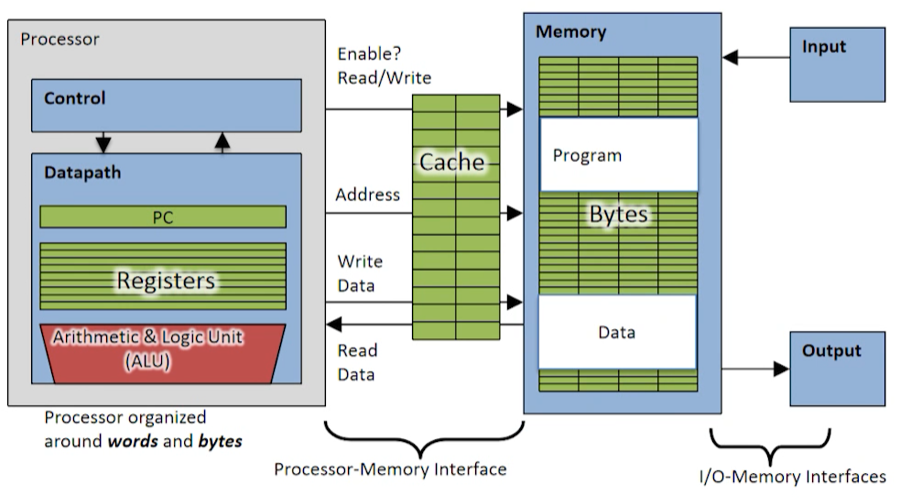

处理器核内部包括控制器和数据通路，数据通路包括PC,REG,ALU。处理器内执行的指令和所需要的数据都来自外部存储系统。通过处理器的控制信号，地址信号和交互的数据信号，进行存取操作。

存储系统由cache和主存组成。主存是按字节存储，存放程序指令和数据，通过cache提高了访问速度，主存还能通过I/O与外部进行数据交互。

数据通路是执行处理器操作的硬件部分，是为了执行指令集中所有操作，控制器是对数据通路进行调度的硬件结构。

### 阶段设计

将执行指令的过程拆分为几个阶段，将阶段对应的电路结构前后串连，模块化。

首先取值阶段根据pc值到指令存储器对应地址取出指令，译码阶段根据指令类型和格式获取指令操作码，立即数操作数，寄存器操作数，执行阶段通过ALU进行算术逻辑操作，访存阶段根据操作码对应的操作数类型，按需进行读写方寸操作，写回操作按需执行写回操作

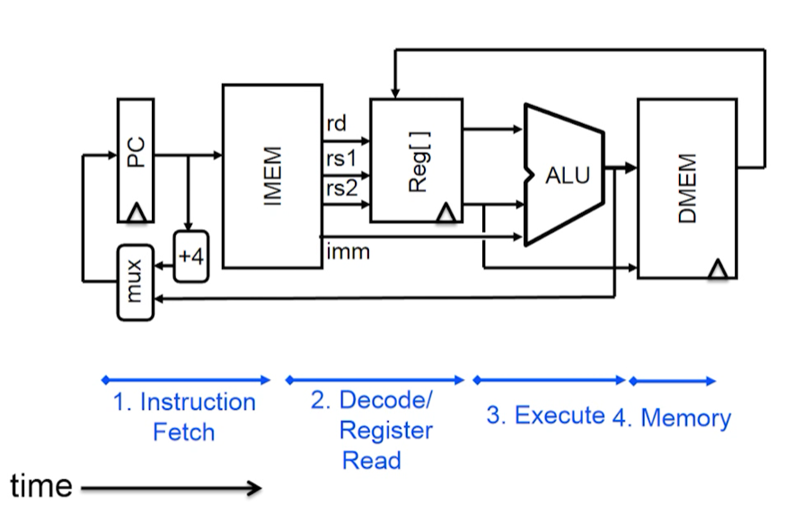

### 数据通路单元

**组合逻辑单元**

**状态时序单元** 主要包括寄存器文件和存储器

寄存器示意图如下，clk用于接受时钟信号，写使能为0，输入输出值保持不变，使能为1，在时钟上升沿到来时将输入数据锁存，修改输出为锁存值。

所有寄存器的组成

2个32为输出总线，busA,busB; 1个32位输入总线，busW;RA选择一个寄存器输入到busA,RB选择一个寄存器输出到busB;由RW选择寄存器， write Enable=1，将busW的数据写入其中；Clk仅在写寄存器时发生作用。读操作类似组合逻辑，接收到有效的RA,RB,读信号，得到busA,busB输出数据。

存储器

需要分为指令存储器Imem和数据存储器Dmem

读存储器，由地址端输入的地址值和存储器对应地址上的数据输出到DataOut；写存储器，将写使能置1，将DataIn输入的数据写入到对应的地址。

### R型指令

读取pc的地址值取到add指令，读取rs1,rs2的值，相加，结果写入rd;pc += 4

数据通路如上图:

从pc读出指令地址值，指令存储器中读出对应地址的指令。根据指令的操作码，func7,func3,判断出是一条add指令，pc+=4,下图是pc+4更新

add还涉及rs1 ,rs2,rd。addrA，addrB是读地址，addrD是写地址，然后输出到DataA,DataB，送入ALU的加法单元。

相加得到的结果输入到写输入DataD

下面的控制器根据add类型反馈给数据通路写使能信号，从而将加法结果写入addrD对应的寄存器中。

时序关系

首先得到pc+4

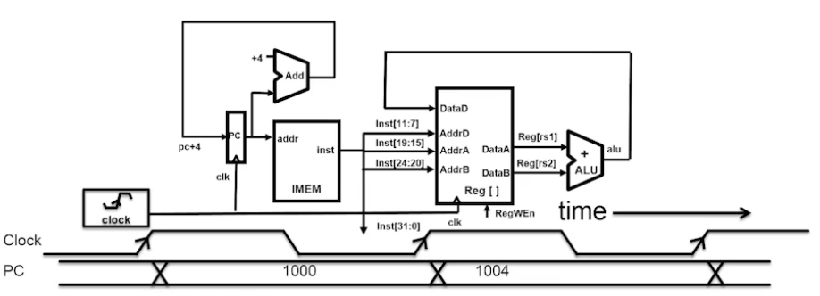

通过取值得到指令编码

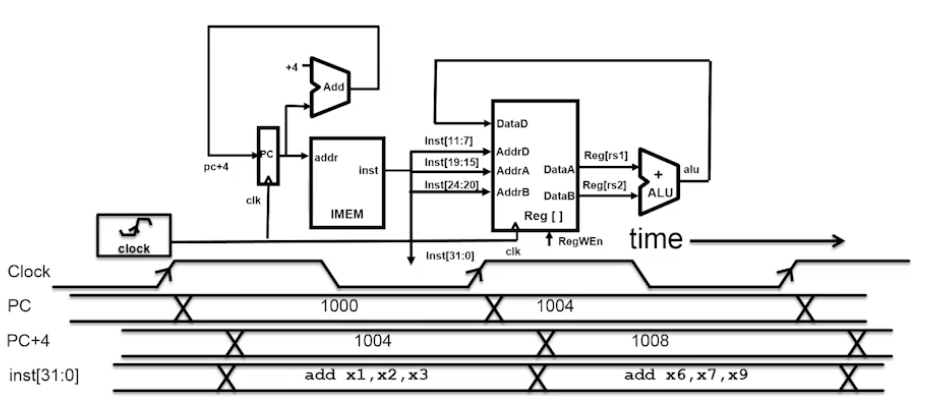

读出两个寄存器值

计算得到ALU结果，最后在下个时钟上升沿到来时将ALU结果存入目的寄存器。pc+4更新pc

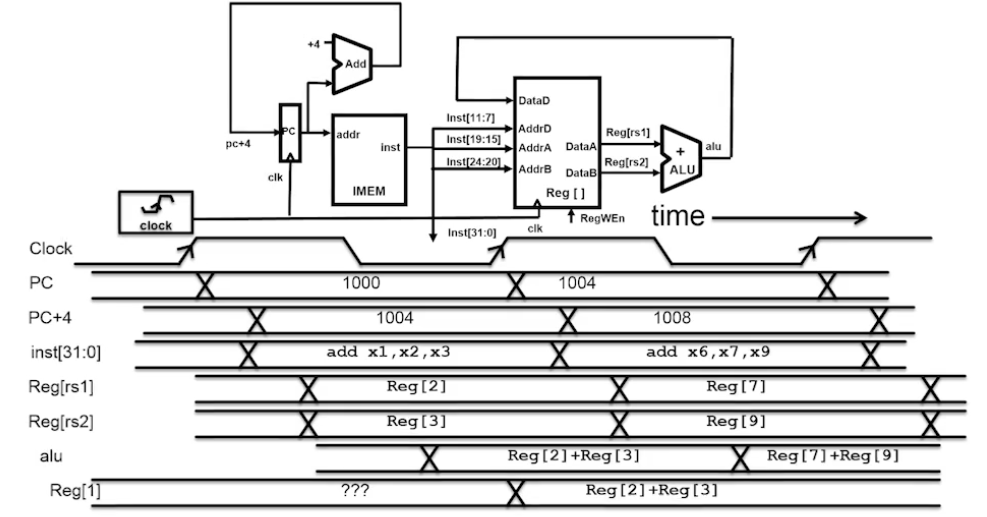

sub指令

和add只有第30位不一样

只需要将ALU改为-操作,ALUsel控制

下面是所有的R指令，根据func3 func7来选择操作

### I型算数指令

有立即数，无func7

R型指令会读出两个寄存器给ALU,这里有立即数，需要添加选择器MUX进行选择。还需要添加选择器控制信号Bsel

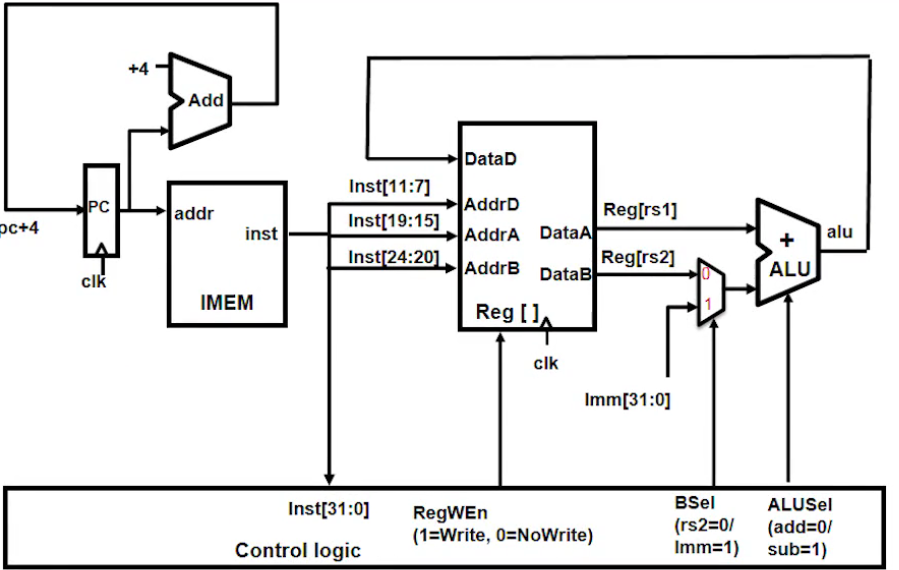

还需要增加立即数生成单元，将立即数的位数进行拓展

执行过程：首先取得pc中的地址，再到imem中取出指令对应机器码。指令中不同编码段分别送到寄存器堆和立即数生成单元，指令送到control logic译码，产生相应信号IMMSel,RegWEn,BSel,ALUSel。pc+=4,输入的寄存器值和立即数到ALU计算，并送到寄存器输入数据端DataD，根据目的寄存器编号，寄存器文件地址，写使能信号将结果写入目的寄存器。

下面是立即数生成器原理

 

### I型访存装载指令

lw

其中x2作为基地址，加上立即数，作为目标访问地址，与addi加法操作相似。

数据通路如下

执行过程如下：

通过pc取得lw的指令编码，pc+=4，根据原寄存器编号和Imm得到Reg[rs1]和拓展的Imm,经过ALU，得到的结果作为访问数据存储器的地址，同时MemRW=read，通过WBsel选择写回到寄存器文件的数据（根据地址从mem读出的数据），并在下一个时钟沿到来时，根据目的寄存器和写使能信号，将该数据写入rd寄存器

相关指令汇总如下，func3区分位宽和符号

### S型访存指令

**sw rs2, offset(rs1)**

M[x[rs1] + sext(offset)] = x[rs2]

执行流程如下：

根据pc取出指令机器码，pc+=4, 寄存器文件获得两个寄存器操作数，reg[rs1]和imm送到ALU得到地址值，reg[rs2]内容保存到数据存储器中，产生write控制信号，这里没数据写回到寄存器文件，RegWEn=0,WBSel可以任意，对结果不影响。

I和S的立即数生成

### B型指令

 有以下指令，并且和之前的指令相比需要更多ALU

需要增加红色部分的部件,其中Branch Comp用于比较reg[rs1] reg[rs2]大小，接受控制器的BrUn BrLT BrEq信号，同时在ALU前增加MUX,选择寄存器文件输出值或PC输出值；PCsel选择pc+4 / pc+Imm存到pc寄存器。

执行流程：从pc寄存器存放的addr取得指令的机器码，由寄存器文件读取到两个操作数，由Imm-Gen得到偏移量，两个操作数经过Branch Comp比较，结果反馈给控制器（红色小箭头），偏移量和pc值通过ALU得到转移地址，控制器根据比较结果形成控制型号PCSel更新pc

其中Branch Comp中BrUN进行输入，BrLT和BrEq进行输出。

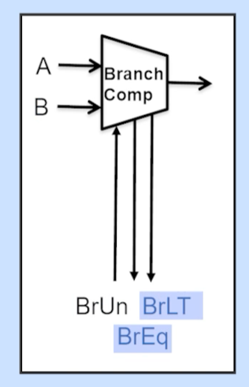

立即数拓展

### I型JALR/J型JAL

jalr rd, offset(rs1) t =pc+4; pc=(x[rs1]+sext(offset))&~1; x[rd]=t

主要修改了写回部分

执行流程：从pc寄存器存放的addr取得对应的机器码，由寄存器文件读取到Reg[rs1],由Imm-Gen读出偏移量，通过ALU做加法，得到转移地址值，根据PCSel选择写入pc+4/pc+offset,由WBSel=2选择pc+4,写入到reg[rd] (DataD)。ImmSel表示I型立即数，ALUSel=add表示加法

JAL

rd, offset x[rd] = pc+4; pc += sext(offset)

主要修改了ImmSel=J型

执行流程：同上

### U型指令

aupic rd, immediate  x[rd] = pc + sext(immediate[31:12] << 12)

lui rd, immediate x[rd] = sext(immediate[31:12] << 12)

lui执行流程：

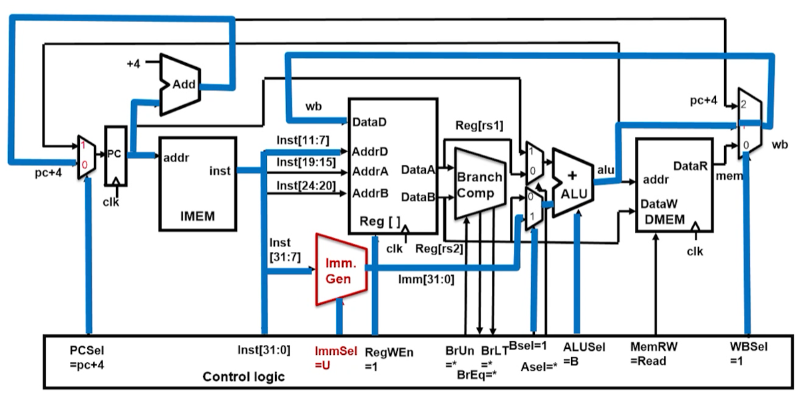

aupic执行流程：

### 控制器

以add执行为例，从指令存储器中取出指令机器码，发送给寄存器文件和控制器，控制器根据编码的格式约定，进行译码产生控制信号。pc+=4不会改变，PCSel = 0, add不会使用立即数，ImmSel不影响，运算结果要写回到目的寄存器，regWEn=1，不涉及Branch Comp,BrUn,BrLT,BrEq都不影响。需要选择DataA,DataB,所以Bsel=0，Asel=0。ALUSel = add；add不需要读写数据存储器，所以MemRW = read避免数据被错误写入；需要ALU的计算结果写回目的寄存器，WBSel = 1

sw

Immsel为S-type

beq

addi关键路径 选项2

### 控制器实现

**指令执行阶段**

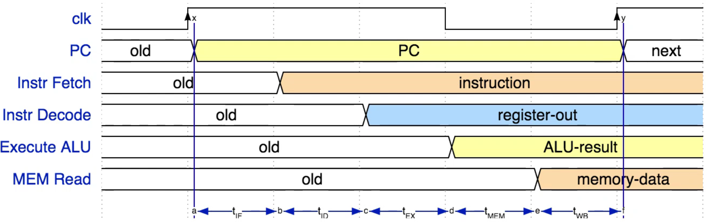

**执行时间**

各个指令的执行时间是不同的

**控制信号真值表**

**具体实现**

ROM或组合逻辑

**区分指令**

举例

**ROM方法**

结构方案

指令编码+条件信号组成输入，经地址译码器，得到对应指令条件下的有效信号

### 处理器性能度量

通用度量取决于三个部分

程序指令数：1.程序自身体量 2.算法  3.编程语言 4.编译器  5.指令集架构

CPI:  1. ISA   2.处理器实现（如单周期的cpi=1)

时钟周期时间：1.处理器架构  2.制造工艺（14nm vs 5nm) 3.额定功率

能耗度量

流水线加速

流水线不能降低单任务的执行时间，但是可以提高多任务的吞吐率

### 流水线设计

 对比时间差异

划分单周期datapath

在划分边界上设立流水寄存器保存状态值,每个都是保持前一区域内的

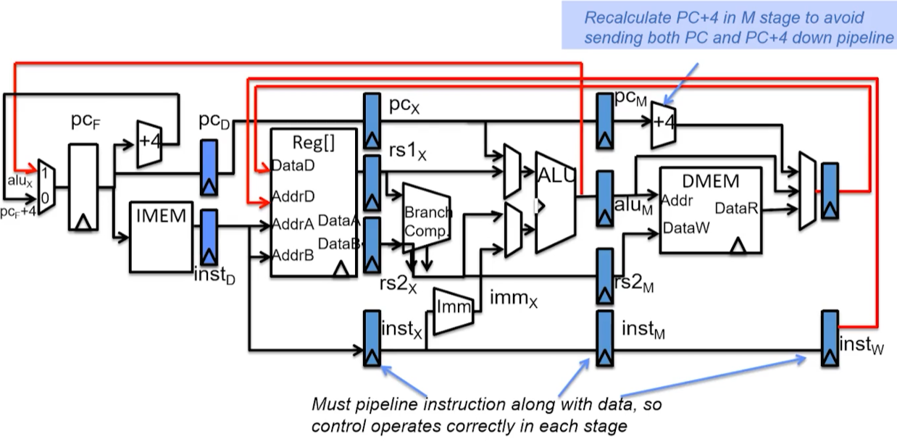

下图是在每个划分的区域分别执行不同的指令

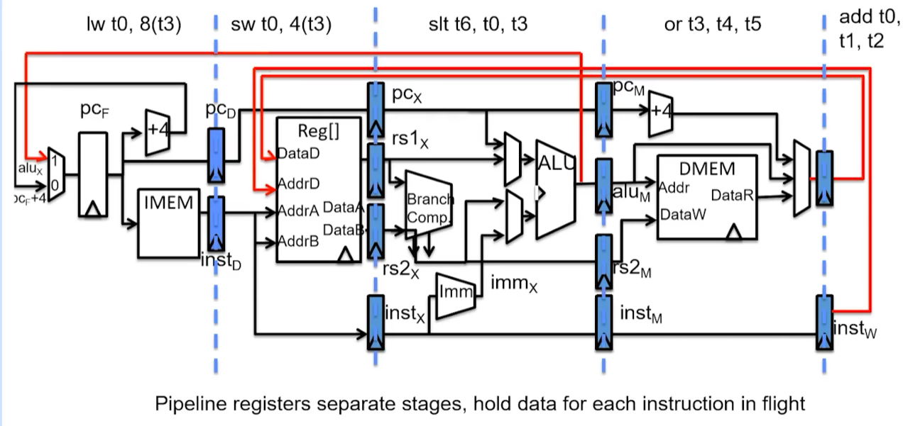

pipelined control实现

### 流水线冒险

下一个时钟节拍中，下一条指令不能执行

三种冒险： 1.结构冒险（某个硬件资源同时被多条指令使用）、

2.数据冒险（指令间数据依赖性）

3.控制冒险 （程序执行流向需要依靠前一条的执行结果）

### 结构冒险

解决方案：

1.轮流使用，阻塞一些指令

2.增加硬件资源

可能发生在regfile,需同时处理两个读和一个写；为避免需要使用两个读一个写端口，同时满足三个请求

可能发生在存储器，指令存储器和数据存储器被同时使用；通过将存储单元分离解决，实际上没分离，只分离了icache dcache。

### 数据冒险

需要读写同一个寄存器时，sw是取原始值还是更新值？

利用寄存器读写较快的特性(100ps)，其他的200ps，每个时钟节拍前一半写，后一半读,图中阴影是访问的先后关系。在高频情况下不适用。

可能因为后续指令用到前面指令的数据

直到第一条指令执行到写回的前半段，s0才更新。第4,5可以取到更新后的值,2,3都没用更新s0,得到错误结果。

解决1：阻塞,但降低性能

解决2：Forwarding转发

从流水寄存器中读取，但是增加了额外的datapath连接

如何判断转发？比较原来的目的寄存器和现在的源寄存器

增加的部件，Forwarding control logic对比上面说的两个寄存器是否相同，控制是否选择转发值。

 

### 控制冒险

将紧跟在lw访存装载指令之后的时间槽称为load delay slot,如果该延迟槽中的指令需要使用前一条load的结果，那么硬件会阻塞一个时钟节拍，等价于插入nop，性能下降；解决思路：将不相干的指令放入该时钟节拍。

可以修改代码顺序

下面是一个很好的例子

但是也有 pc不能确定的情况，有nop浪费，使用分支预测

### 超标量乱序处理器

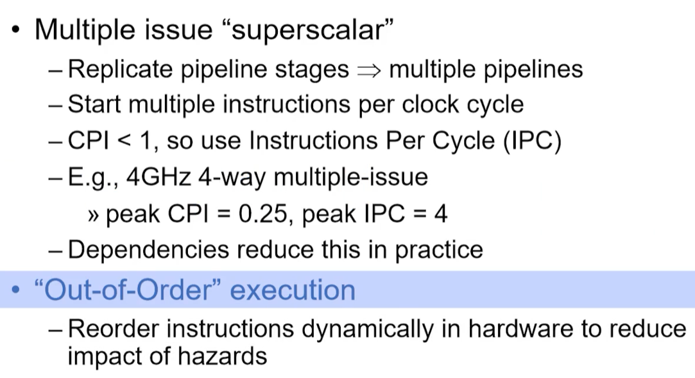

工作示意图

riscv适合流水线实现

### 存储器层次结构

层次管理，这里需要实现的是cache和主存之间的管理

cache在系统中的位置，下图中处理器以字或字节来组织数据，存储器包括cache在内以块为单位来组织数据，一块包括多个字。

时间局部性：如果存储器某位置的数据被访问，将来可能被再次访问。

如何利用？将最近访问的数据保存在离处理器更近的位置

空间局部性：如果存储器某位置被访问，那么相邻位置也可能被访问。

如何利用？取数据的适合取包含连续数据的数据块到距离处理器更近的位置

cache实际是内存的子集，因此多个内存地址会映射到cache的同一个位置。块是cache和主存中的传输单位。

直接映射cache:每个主存地址对应cache中一个块，只需检查cache中的一个位置来判断数据是否在cache中。

下图就是直接映射cache,这里一个块1字节,注意对应关系是有序的，映射的索引可以有存储器地址低两位。

当每个块大小超过1字节时，下图每块(行)2字节

cache中通过tag记录地址信息，判断cache中的数据块来自哪个存储器地址。

划分存储地址，第一块检查是否是所需的数据，第二个用来在cache中选择块，第三个块内偏移。三个都是用无符号整数。

cache字节数如下

无cache访存步骤

如果有cache

读取主存时可能有三种情况

cache术语

cache的计算

当开始新的Program时，cache没有有效信息，此时需要valid bit位，所有项的有效位都初始化为0

## 流水线

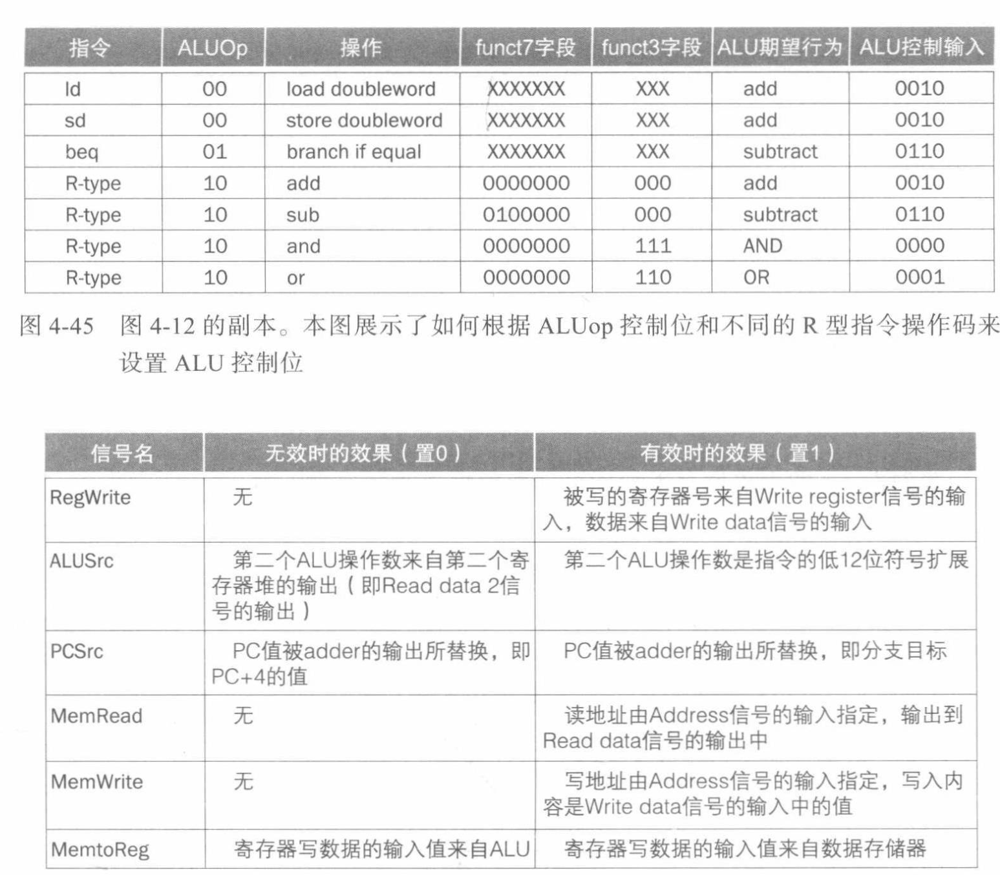

## Cache

SRAM：通常有一个读写端口，对任意位置的数据，访问时间固定。

Dram：需要刷新

参考https://blog.csdn.net/qq_41587740/article/details/109104962

## interface

握手信号：valid ready

valid : 输出有效数据

ready:准备好接收数据

仅当 source valid 并且 sink ready时，数据会在下一个上升沿从source发送到sink

如果一直满足条件，即二者都是高电平，那么

## 整体架构 

ece4750

LW  SW实现

注意与imem dmem的交互

JAL JR

写回法

## difftest

