# Cache

## 概述

产生原因

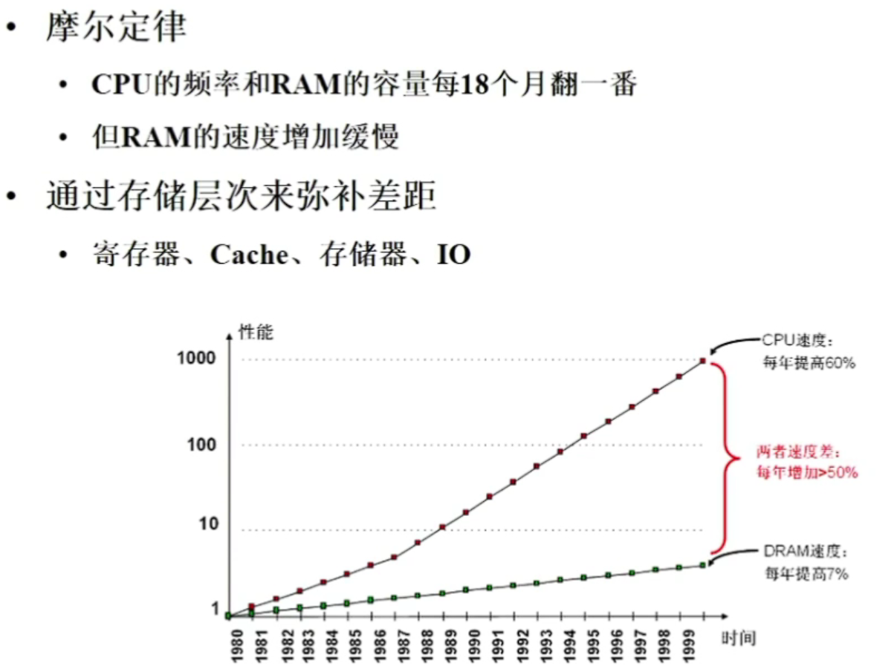

为什么需要：如果没有cache，可能会遇到取指花费100拍，译码花费1拍这种事情，执行有效操作的时间过少。

片内RAM面积主要来做cache,一个CPU内部晶体管面积主要都是给Cache 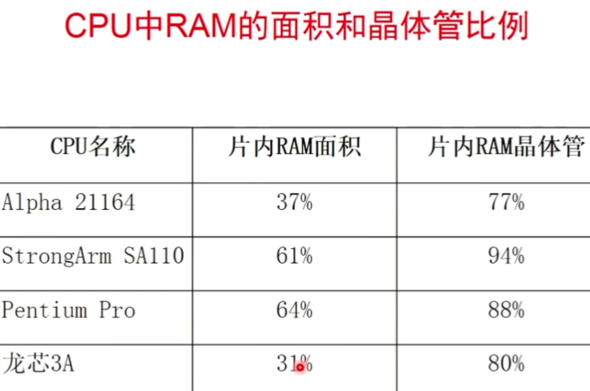

越小越简单的硬件越快，但是会越昂贵。

cache的内容是主存储器内容的一个子集。考虑以下问题：L1cache和寄存器堆速度相同的情况下，区别在哪？寄存器堆有自己的寻址空间，cache没有独立的寻址空间，而是子集。cache没有程序上的意义，只从正确性角度，用户程序开发者没有Cache的概念。 

## cache格式

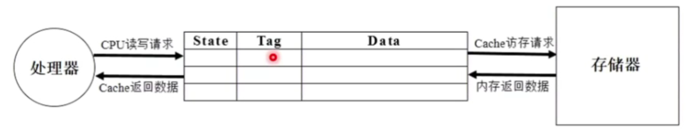

Data存储数据，cache作为一个子集，但是又动态变化，所以需要知道data对应的地址，tag是物理地址的一部分

内存中的一个数据，直接相联只能放在一个位置，全相联可以放在任意位置，组相联可以放在一组内若干个位置。

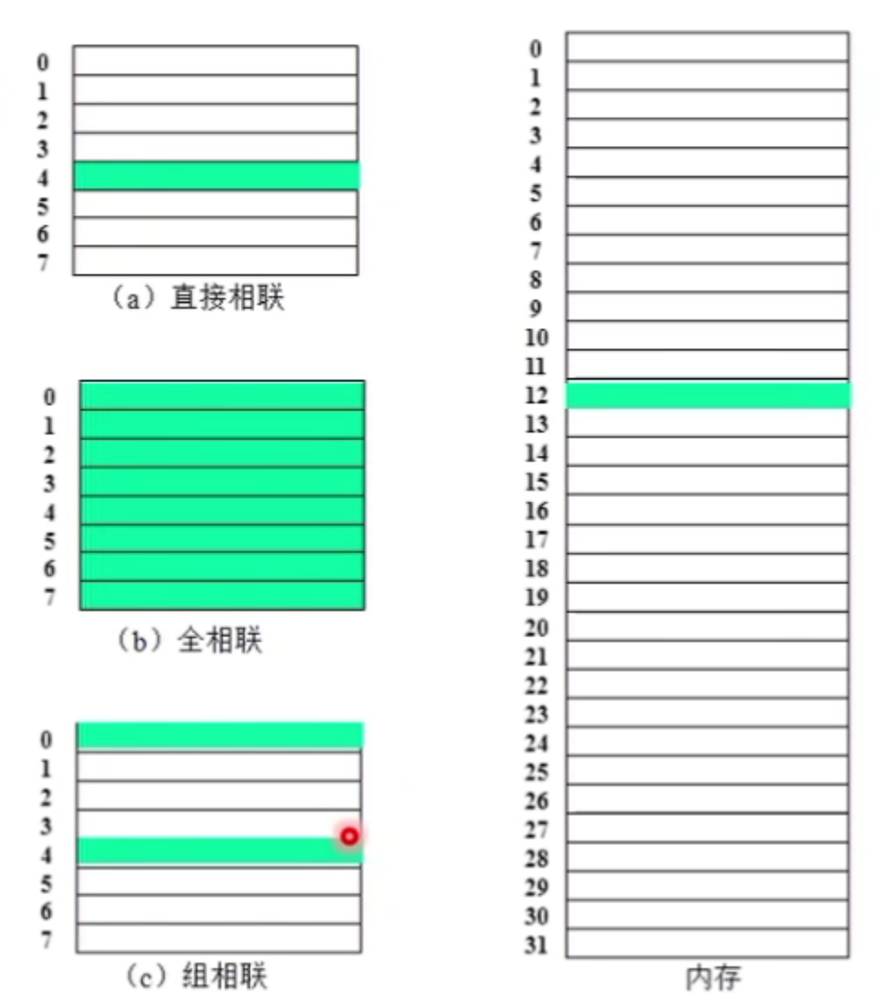

下图是组相联

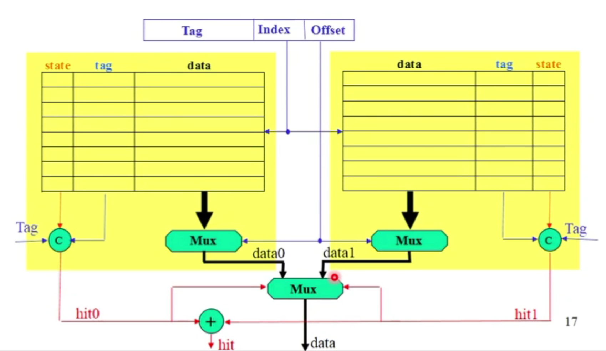

两块黄色的部分是两路cache,最上面被分割为3部分的是地址。data的数据宽度通常大于1或4个字节

data部分存放的数据宽度不会只有1个或者4个字节，在32位机器上地址32位，64位机器有效地址通常48位或52位，tag存地址的一部分，如果data存一字节，tag比一个字节要多，那么为了存一个字节代价过大。ddr外存带宽很大是因为做了预取，从ddr3开始只有burst读写， 因此现代处理器cache行宽度也即data宽度都是64字节或者64字节整数倍。如果data宽度比tag宽度少，那么效率太低。offset是data的偏移量,如果是64字节，那么offset是6bit。index代表在cache中放在哪一行，如果有128cache行，那么index有7位。index和offset确定之后，需要比对tag,c是全等比较器，如果相等则hit。

读的步骤是同时对两组的cache line读取，哪边命中选哪边。index大小和一路cache的容量有关系，和cache整体容量没有关系。如果是64k byte 4路组相联，实际只需要看一路16k byte计算index。cache可以不命中，但是不能多路命中。

全相联 用来做TLB，硬件复杂，延迟大，但是命中率高。

## 替换算法

容量有限，因此需要流动性。常见算法：随机替换，LRU(时间局部性), FIFO（通常最糟糕）。

一级cache或者核内cache，随即替换和LRU，伪LRU使用较多。伪LRU是从访问较少的里面随机挑出几个,这样可以降低复杂度，精确的LRU太复杂。LRU通常最好

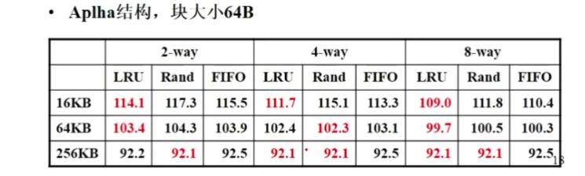

## 写策略

写命中策略

```
写穿透（写cache + 写内存），内存里的数据永远是最新的，但是代价过大，可以添加write buffer，脏数据

写回 （只写cache不写内存），需要有效位和脏位，cache状态复杂
```

写不命中策略

```
写分配, 先把失效块读到cache，再在cache中写， 一般搭配写回
写不分配，写cache失效时，直接写进内存， 一般搭配写穿透
```

  

## cache性能分析

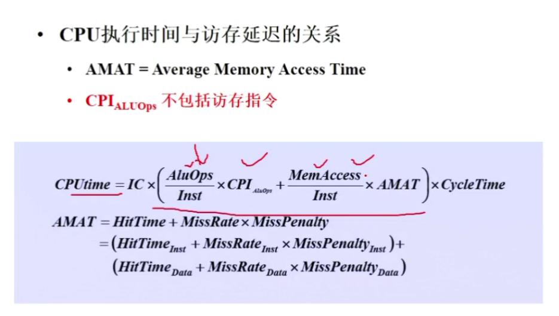

IC：inst counter（编译器负责）,中间是cpi ，命中延迟 + 不命中延迟

AMAT降低那么CPUtime就会下降

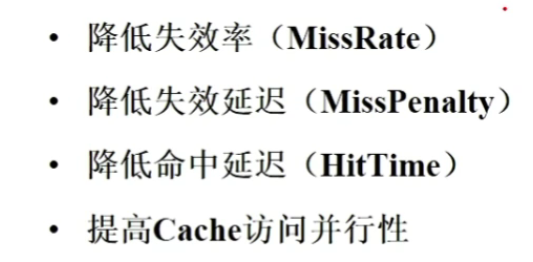

到视频1.02H


## cache概述

L1 cache每个核私有，L2 cache可能是多核间共享。

icache需要每周期读取多条指令，除非遇到预测调整的分支指令，延迟才回到对性能造成影响。dcache需要在每周期内由多条load/store指令访问，需多端口设计，但是dcache容量较大，占用面积过大，并且延迟过大，对流水线后续有影响。

cache由tag和data组成，data部分保存一片连续地址的数据，tag部分存储这部分数据的公共地址。一个tag和它对应的所有data组成了一个cache line,cache line中的数据部分是cache data block,如果一个数据可以存储在cache中多个地方，这些被同一个地址找到的cache line称为cache set。

直接映射：物理内存中的一个数据在cache中只有一个地方可以放置， 组相联：有多个地方可以放置，全相联：任意地方都可以放置。

tlb, victim cache采用全相联， icache dcache组相联。

cache缺失直接影响处理器性能，影响缺失的情况如下：

1、compulsory, 第一次访问的数据或数据肯定不会在cache, 指令预取解决

2、capacity, 被实际硅片面积限制

3、conflict，如果是两路cache，但是频繁使用三个数据属于同一个cache set, 可以使用victim cache解决。

以上称为3C定理。


## cache组成方式

### 直接映射

最容易实现，使用index找到对应的cache line，再使用tag进行比较，cache中有多个数据，通过block offset来找到对应的数据。有一个比较大的缺点，如果两个index部分相同的存储器交互访问cache，就会导致cache缺失。如下图

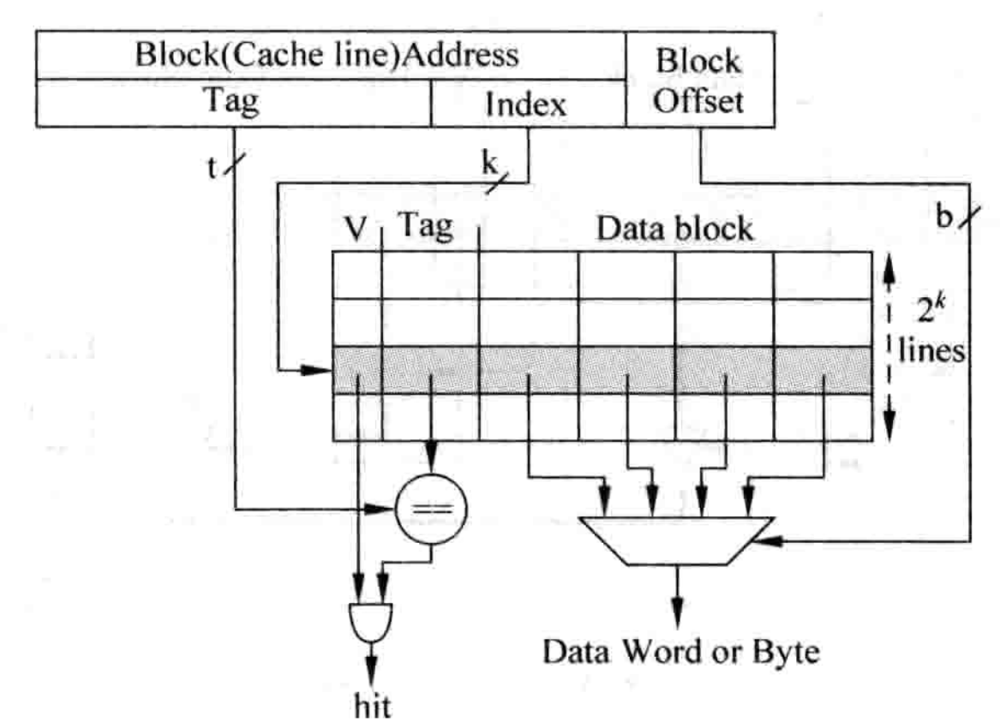

下面是一个简单的cache结构划分，一共是32位存储器地址

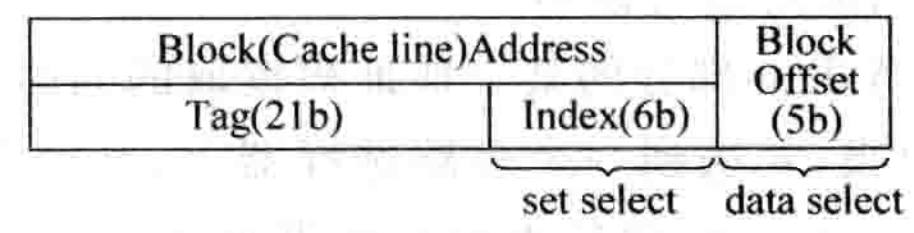

block offset = 5 , 说明data block 为32字节，index = 6，说明共有64个cache line。 通常以数据部分大小代表cache大小，因此上面2KB大小。

### 组相联

如果一个数据可以放在n个位置，则称为n路组相联。

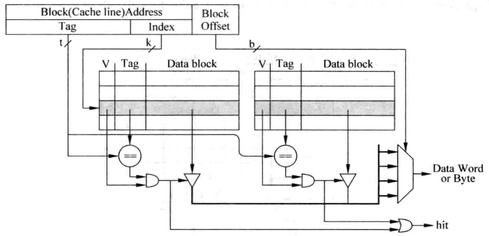

上图是2路组相联，一个index可以索引到2个cache line，这两个合称为一个cache set。这种方式延迟更大，甚至需要流水线，但是可以显著降低cache miss。tag和data的访问可以串行或并行。对于并行访问的结构，当tag部分被读取出来时，data部分也会被一起读取，然后送到多路选择器，way-mux根据tag得到对应的data-block，选择出合适的字节（data alignment）。

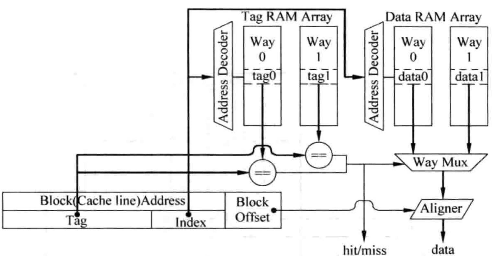

cache一般是关键路径，需使用流水线，icache流水线影响不大，但是dcache流水线会增大load指令延迟，对处理器性能产生负面影响。下图是并行访问的流水线

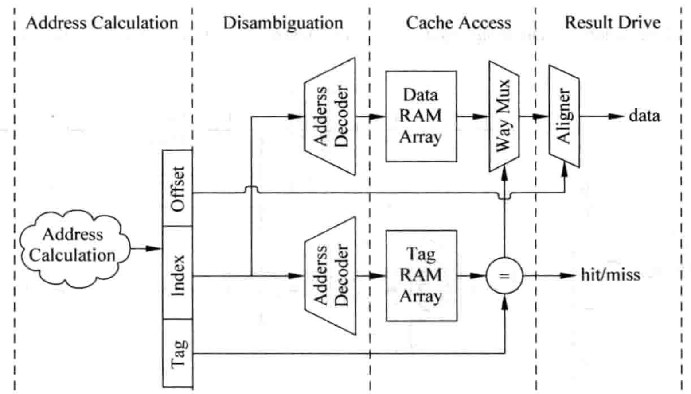

address calculation计算出存储器的地址，disambiguation检查load/store指令的相关性，cache access并行访问tag sram 和 data sram并从多路选择器选择datablock,result drive根据block offset选出最终所需数据。

串行访问如下图

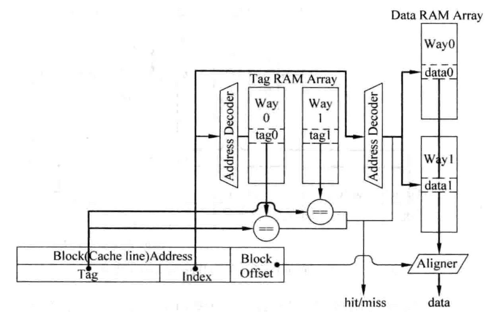

首先访问tag sram，由tag比较结果直接访问对应路的数据，不需要多路选择器，且只需访问data部分指定sram，其他的sram不需访问，可以将他们使能信号置为无效，节省功耗。图中完全串行tag sram和data sram访问，延迟很大，仍然需要流水线，见下图。

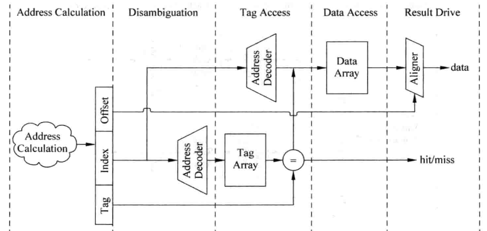

此时不需要多路选择器，降低了访问tag sram和data sram延迟，但cache访问增加了一个周期，增大了load指令延迟。

对比并行和串行，并行时钟频率低，功耗大，但是周期小1，适合顺序执行处理器。串行时钟频率高，适合乱序。

### 全相联

对一个存储器地址，它的data可以存放在任意一个cache line中。因此存储器中不再有index部分，直接比较整个cache中的tag，实际就是内容寻址的存储器CAM，实际中也是使用cam存储tag值，使用sram存储数据。灵活度最大，缺失率最低，延迟最大，因此容量也不会很大，TLB使用这种方式。

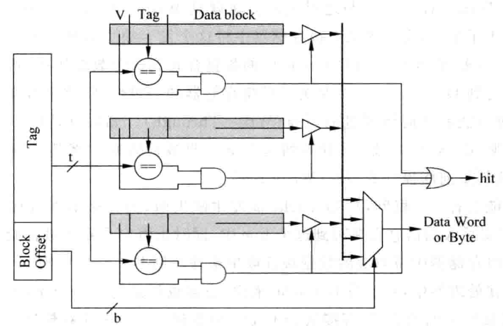


## cache写入

L1cache分为icache和dcache，注意icache不会被直接写入内容，修改需要借助dcache，将
