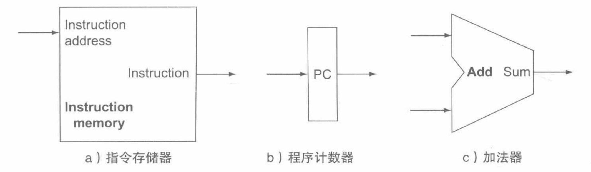
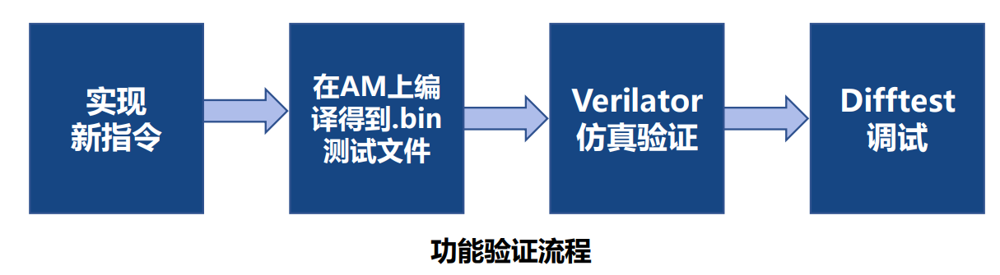
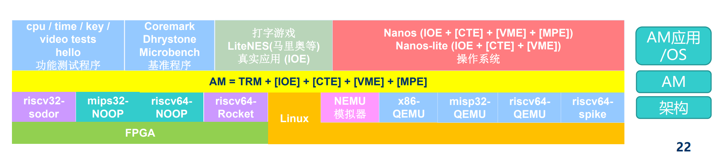
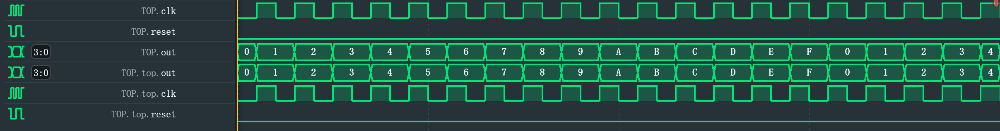
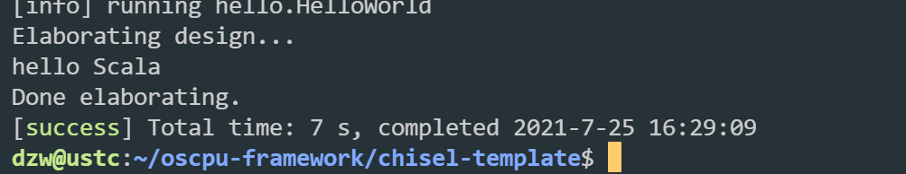
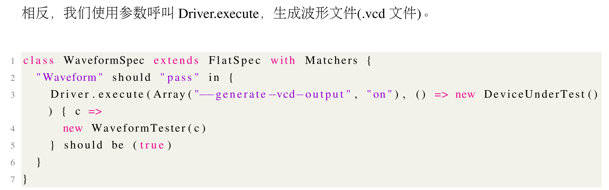
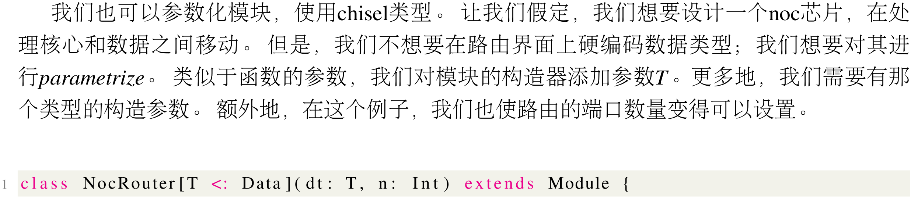
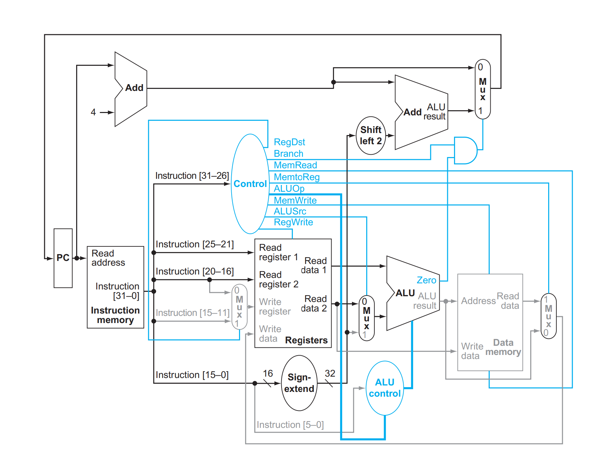
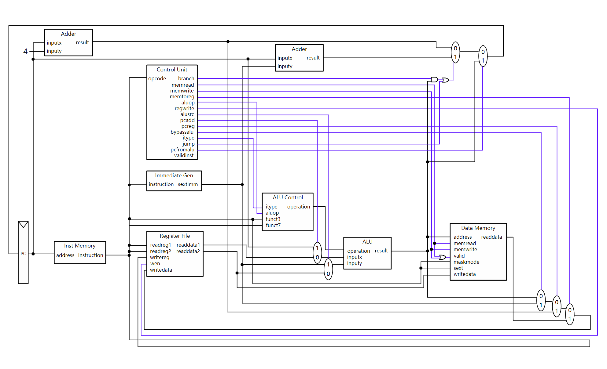

# riscv cpu

## 参考

https://medium.com/programmatic/how-to-design-a-risc-v-processor-12388e1163c

https://www.zhihu.com/people/unicornxdotw/posts

https://cs.ucdavis.edu/schedules-classes/ecs-154b-computer-architecture

软硬件接口第五版riscv   cs61c   cs152   ecs154b

计算机系统要素

KISS法则： Keep It Simple, Stupid.  防止完美主义


## 目标

5级   64位  有csr  cache AXI 分支预测  300h左右


## 前期准备

1、学习计算机组成原理、计算机体系结构；

2、了解CPU的工作原理，单周期和流水线；

3、了解RISC-V指令集构成；

4、配置开发环境（chisel或verilog），了解Verilator;


## 基础: CPU核心构建与调试 (3个月)


### Task 1

时间: 1 Week

1. 实现单周期, addi 指令; 运行 addi 指令, 并得到正确结果

#### 7.23

1. 安装环境

2. 阅读 https://medium.com/programmatic/how-to-design-a-risc-v-processor-12388e1163c

3. 学习chisel 

#### 7.24

1. 阅读ucb的riscv-mini x
2. 学习组成原理基础知识 :star:
3. 继续看chisel,运行起来跑一个小的带测试的demo  x
4. 根据kiss准则尝试搭建框架 x


状态单元：有内部存储功能，至少有两个输入和一个输出。



指令存储器用于存储程序指令并且根据给定地址提供指令，存取指令需要a b c。


#### 7.25

1.项目的各个组件了解+认识整体框架+运行起来  chisel+veirlator+sbt  :star:

2.学习单周期原理  :no_entry:

**chisel**:基于scala,将代码最终转换为Verilog,面向对象 chisel-> fir中间代码 -> verilog

**sbt/mill**:scala语言的构建工具，增强了灵活性，但是对于初学者来说同时也增加了上手难度

**Verilator**:Verilator是一种Verilog/SystemVerilog仿真器，可用于编译代码以及代码在线检查。

**difftest**: 

**AM**: cpu-tests验证我们开发的CPU核的正确性，cpu-tests的编译需要依赖AM。在AM上开发的应用(包括OS)可以无缝迁移到各种架构

**Git**:

开发流程



总的来说是：

(CPU)实现硬件功能 -> (AM)提供运行时环境 -> (APP层)运行程序



**单周期处理器**

参考oscpu的verilog代码，分取指译码执行阶段，只实现了addi。


今日目标： 走一遍仿真流程，写一个chisel的helloworld  ， 将示例中的Counter改成chisel实现，将riscv-mini/dinocpu跑起来，学习相关框架

oscpu仿真：



chisel hello world

使用chisel-template框架



chisel counter with test

```
:= 代表右边的驱动左边的信号，这是有向操作符
Module是内建class，所有模块都要extend,Module自带clock和reset，拓展Module意味这被映射到verilog中的硬件模块
硬件构造不要使用var
wires可用于参数化类型，可以出现在:=左边或右边，用在when elsewhen
1.U + 1 是错误的
Reg保持输出值到上升沿
时序逻辑：需要step更新   组合逻辑：poke会直接更新
chisel区分类型和硬件节点，val myReg = Reg(UInt(2.W))输入类型正确，val myReg = Reg(2.U)输入节点错误
RegNext将输出延迟一个周期
```


**7.26**

1.完成chisel-bootcamp(前三章) :star:

2.学习riscv-mini架构,运行+修改 ； 准备在此基础上搭建一键集成开发环境 :no_entry:

3.读视频中实现的verilog代码和riscv-sobor的1stage，了解需求，看cs152 pdf,软硬件接口第四章阅读 :star:

4.kiss准则，不要追求完美，框架一步一步搭建！

5.还剩3天，来得及写完单周期addi吗？？？


riscv-sodor

根据是否包含存储器，分为组合逻辑（不含） 和 时序逻辑（含）
组合电路输出仅仅取决于当前输入

译码器 n位输入 2^n位输出


多选器


**7.27**

1.继续补基础，看软硬件接口+cs152阅读材料，cs61c

2.学习sodor的一级流水线和oscpu过程

看了mooc-zju的I型指令流程:ok:

oscpu学习 :ok:

sodor 还需继续补充zju的相关基础 :book:看到控制模块，明天看完

看完chisel-book+chisel tutorial 然后开始写ALU Reg 取指译码执行；先实现32位的addi





设计思路：软硬件接口4.4



存储器实现


首先是ALU and ALU tester，然后取指 译码 执行。

吃完晚饭开始写。一级流水线: sodor 和 dinocpu.


7.28

还剩两天，早上看完基础。下午开始写，先跑起来再说

早晨看完基础:ok:

继续看流水线 + cache  :ok:

开始看具体实现 control  reg alu ​ ​imm​g​en​ ​i​ns​t​r​uc​t​io​n​ ​b​r​c​on​d:ok:


7.29

读懂整个riscv-mini,包括{parameters,field,case object,<>,flipped}   ,config作用，Tile作用， datapath如何组织，cache组成  :ok:

看nutshell 和  xiangshan文档  :ok:  比较多的细节不太理解

重写一下oscpu的实现:ok: 尝试跑通:warning:   然后看difftest视频:warning:


重写完之后有管中窥豹之感，不知道运行流程，为什么这样运行，明天继续看、

看verilog + 写ustc arch lab


7.30

理解代码的运行流程，从哪开始，从哪连接，从哪数据流的流动，了解verilog语法。:ok:

实际生成的是一个静态的文件，由test.cpp读取，输入信号进行测试，数据的流动根据输入进行，但是电路图需要进行连接。

昨天看到的三级流水线是怎么做的  :ok: 。 makefile 测试 移植没有看，代码没有实现write机制，流水线三级主要是加nop判断。

参考ECS154B​ ​视频​+​代码​ :star: 写完通过他的test （七天）

晚上安装环境


ecs154b + cs152 (cs163?)


8.2

Assignment2写完，先debug I-type :ok:


8.3 看流水线原理，看riscv-mini 和 sodor 的流水线，开始实现流水线

```
forward bypassing 是一个意思 
```

8.4 继续看流水线，riscv-mini需要了解cache，中断；先添加difftest,根据进度来。

下午：看difftest视频， 接入difftest,了解流程，scala -> verilog   AM:coffee:  difftest 怎么联系起来。先对riscvmini的.v进行difftest，然后研究makefile

晚上 实现64位


8.5 早上看完流水线部分

其余时间搭建自己的框架，学习chisel,  rv64,  参考riscv mini,按照ysyx步骤，先通过单周期rv64，再加上difftest,再添加其余指令，通过所有test。

解决cache TODO

然后根据电路图写rv64


## Task 2 

7.16-7.30

时间: 2 Weeks

1. 加上 difftest
2. 实现更多基础指令, 通过 cpu-test 和 riscv-test 测试


添加diff-test and riscv-test，

8.6 ld st 的 mem怎么做？如何连接数据通路，控制通路？ 阅读https://blog.csdn.net/qq_34291505/article/details/87862433

怎样将指令读到imem对应的地址上面？load-mem。 先写通路连接，再看dinocpu如何测试。有点乱，ld/st需要用到mem,但是mem由哪些组成，bus怎么连接？ 一级流水线的必要组件是哪些？依次看riscv-mini,sodor-1stage,ustc-verilog,dinocpu,yycpu,mb-core

晚上看刷课部分内存相关，继续加基础

看明白yycpu，条理很清晰，

yycpu

```
Fetch  ~icache fe2ex
Ex     ctrl RegfileRIO fe2ex ex2wb ex2fe
WB     RefgileWIO  ex2wb
```

生成verilog参考riscv-mini的Makefile,报错！

还需要看Veritor的视频，关于.cpp的使用部分。后面的实现看科大的和dinocpu


8.7

看cache视频，看完yycpu, 看verilator视频了解怎么生成.v文件，今天的任务是将cpu-demo跑起来，对每一个文件进行测试。

8.8

本周任务，做完dinocpu和ustc archLab。

下午get dinocpu pipelinecpu的设计


#### 8.9 

先将书和ustc文档cache原理看明白，然后学习riscvmini，dinocpu

书4.7-4.10, cache实现部分


#### 8.10

继续看内存，对照图片和文档，riscv-5stage


#### 8.11

follow nutshell from scratch，基础知识已经了解差不多了。


#### 8.12

nutshell 接完difftest，但是对接入的difftest不太了解


## Task 3

8.1-8.15

时间: 2 Weeks

1. 加一条自定义指令, 执行后输出单个字符, 可运行 hello 程序
2. 添加 mcycle 寄存器, 通过 time-test 和所有 benchmark, 运行字符版的超级玛丽


#### 8.15

改RAM 适配Difftest


## Task 4

8.16-8.23

时间: 1 Week

1. 实现AXI总线, 接入串口, 并且去掉自定义指令
2. 通过AXI总线访存


8.16 


目前应该的进度

## Task 5

8.23-9.3

时间: 1.5 Week(s)

1. 添加mepc, mcause, mstatus特殊寄存器,
2. 实现ecall指令, 并运行yield-test


## Task 6

9.3-9.10

时间: 1 Week

1. 添加更多的csr，运行rt-thread

## Task 7

时间: 2 Weeks

1. 建立流水线框架，实现RV64I基本指令的流水化，解决数据冒险与控制冒险

- **RV64I**：整数指令，拥有64位寻址空间，32个64位寄存器。

## Task 8

时间: 0.5 Week

1. 接入spi模块，从flash取指令

## Task 9

时间: 1 Week(s)

1. 集成到SoC并进行测试


还剩42天，重新架构，目标：乱序多发射


1. mem cache axi
2. csr  8.19 搞定
3. 五级流水线debug
1. 分支预测
2. 乱序多发射


8.19中断

