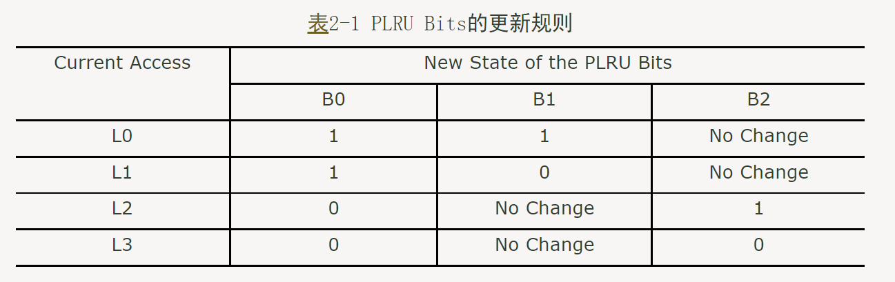

# 乱序处理器进度记录

## 总计划

## 

## week1 

目标：搭建顺序流水线标量处理器，单周期，总线，流水线

### day1 

参考oscpu一键搭建环境，阅读zhoushan v0.2，开始写rv64i单周期，ram相关接口都已经给出，较为方便。

- [x] 设计接口
- [x] 基础组件Alu Bru Lsu Constants
- [x] IFU IDU EXU 
- [x] Core连线

遇到逻辑环，卡住

### day2

- [x] 阅读Zhoushan cache 不太理解具体逻辑

[浅谈Cache Memory--目录_sailing_新浪博客 (sina.com.cn)](http://blog.sina.com.cn/s/blog_6472c4cc0102dw61.html)

###   day3

- [ ] Pass single rv core
- [ ] read chisel book

### day4

- [x] 调整了时序部分

### day5

- [x] 修复ld/st

### day6

- [x] pass all tests
- [ ] add pipeline

### day7

- [ ] add pipeline

- [ ] read zhoushan nutshell xiangshan

