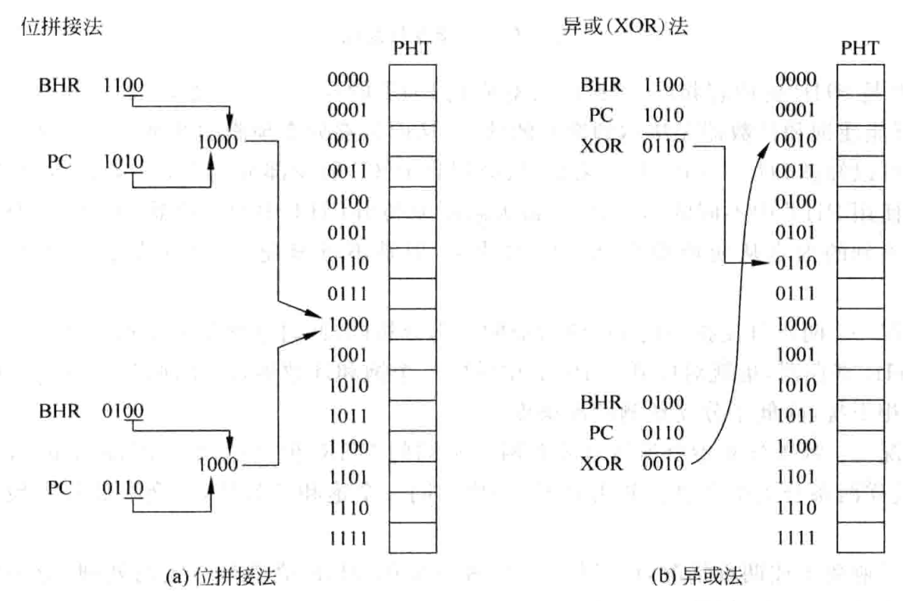
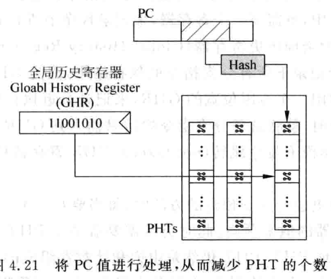

# 分支预测

## 总览

分支预测包括两个要素

1、方向， 是否跳转。部分riscv指令如JAL JALR是无条件跳转的，而BEQ等指令需要要求满足才能跳转。

2、目标地址，跳转的目标地址通常位于指令当中。又分为两种情况：直接跳转， pc + offset, offset范围通常不大，较为容易进行预测，推荐；间接跳转，目标地址来自通用寄存器的值，可跳到处理器空间的任意位置，并且该通用寄存器的值可能来自其他指令的结果，需要等之前的指令进行到流水线的执行阶段才能得到，加大了预测失败的惩罚，但是程序中间接跳转通常是来自call/return指令，可以寻找规律。

普通流水线如果深度不深总是预测不执行，在执行阶段得到方向和目标地址之后才进行判断。如果跳转，需要抛弃在该分支指令之后进入流水线的所有指令，不发生跳转则没有影响。举例Mips r3000, 在译码阶段得到分支指令的两个结果，如果预测失败，只需要抛弃取指阶段的一条指令                                                                    

对于复杂处理器，使用动态分支预测，下文的分支预测都是指代动态分支预测。

首先需要知道从icache中取出的哪些指令是分支预测指令，对于多发射的超标量处理器来说，需从指令组中找出分支指令。

容易想到的方式是从icache中取出指令后，就进行快速译码，然后将分支指令对应的pc送到分支预测器，当处理器的周期时间较小时，icache的访问可能需要多个

周期才能完成，采用上图的方式，从取指令到分支预测得到结果，间隔了好几个周期，这些周期内只能顺序取指令，也就是预测不发生跳转，降低了预测准确度。并且图中译码和分支预测都放在同一个阶段，严重影响处理器周期时间。一个解决方式是，在L2cache写到icache之前进行预解码，然后将是否是分支指令的信息和指令一起写到icache中。但是从取值到分支预测得到结果的时间仍然很长。

需要明白，在流水线中分支预测越靠前越好，这样预测失败的惩罚会大大降低，所以选择取指令时分支预测，这样下一个周期就能根据预测的结果继续取指令。

## 分支指令类型预测

对一条指令而言，物理地址是会变化的（取决于操作系统将它放在物理内存中的位置），但是虚拟地址PC值是不会变化的，同一个进程中每一个PC对应固定的指令，从而可以使用pc进行分支预测，但是在进程切换时，需要将分支预测器中的内存进行清空，如果加入ASID(上下文切换id),就可以将他和pc一起预测，不用清空。

在pc值刚产生的周期，根据该pc值来预测本周期的指令组中是否存在分支指令，以及预测的方向和地址。

当程序开始执行，每条指令对应的pc也固定了，因此可以根据pc来预测是否是分支指令。当这条分支指令第一次被执行完后，后面再次遇到这个pc就能知道当前的指令是跳转指令，这里仅能识别是否是分支指令，对于方向和目标地址，看下文。

## 分支指令方向预测

对于循环`for(i=0;i<1000;i++)`,for语句会被编译成一条分支指令，该分支指令会向同一个方向执行1000次，因此他的方向是有规律的。

比较简单的预测方法是直接使用上次的结果，也称为last-outcome prediction。

图4.6算法错误率低达0.002%,但是图4.7算法正确率为0，因此该预测方法并没有用于现代处理器。现代处理器都是基于两位饱和预测器(2-bit saturating counter)。

### 基于两位饱和计数器的分支预测

基于两位饱和预测器根据一条分支指令的前两次执行结果预测本次方向，使用如下状态机

Strongly not taken : 编码00  饱和     预测不跳转

Weakly not taken   : 编码01  不饱和  预测不跳转

Weakly taken          : 编码10  不饱和  预测跳转

Strongly taken        : 编码11  饱和      预测跳转

处于饱和态时，两次预测失败才会改变预测结果，当分支指令总是朝着一个方向时，就处于饱和状态，方向总是变化时，就无法处于饱和状态。上图是其中一种状态机实现，下面再给出两种

对于一般的基准测试，状态机的变化不会取得更优结果，但是对于初始状态，需要根据实际情况决定，通常使用strongly not taken 或者 weakly not taken决定。可以使用格雷码对状态机进行编码，这样状态切换时只有一位会发生变化，减少出错并降低功耗。在两个饱和状态，计数器达到最大或者最小值，此时分支指令的方向如果继续保持不变，，就会使状态停留在原地不再发生变化，相当于“饱和”。

举例说明，`for(i=0;i<m;i++)` 假设第一次循环时处于weakly not taken(复位状态),因此预测不会跳转，显然预测错误，因此状态机跳到weakly taken,在循环的第2次到第m-1次，分支预测都是成功的，在最后一次会产生一次错误预测，使状态机跳到weakly taken状态，因此整个循环产生了两次预测错误，出错概率2/m,如果m足够大，那么两次出错可以容忍。

由例子可以看出，两位饱和分支预测器的核心理念就是当一条分支指令连续两次执行方向都一样时，第三次也会有同样的方向。因此当一条分支指令偶然发生变化时，预测值不会立即变化，而是由一定延迟，偶尔的变化将会被过滤掉。

如果使用三位饱和分支预测器，会引起复杂度上升，需要更多存储资源，产生的额外开销造成的负面影响远大于预测精度的提高。

通常每一个pc都对应一个两位饱和计数器，因此对于32位pc需要 2^30 x 2b大小的存储器，指令是字对齐，因此不考虑pc低两位(pc+=4)，但是实际芯片无法使用这么大的存储器，考虑到并非所有指令都是分支指令，使用如下方法来存储两位饱和计数器的值。

PHT(pattern history table)是一个表格，里面存放所有pc值(pc的一部分)对应的两位饱和计数器的值，该PHT使用pc值的一部分进行寻址，图中使用k位寻址，因此PHT大小是2^k x 2 bit。

这样会产生一个问题，kbit部分相同的所有pc值都使用同一个两位饱和计数器的值，如果这些pc对应的指令中不止一条分支指令，那么相互之间会产生干扰，又称别名。如果两个别名的分支指令的方向相同，例如都会发生跳转，那么对应的两位饱和计数器就会保持在饱和状态，此时准确度不会发生变化，这种成为中立别名。如果两个别名的分支指令的方向不同，称为破坏性别名(destructive aliasing)。使用上图的方法虽然会降低一部分准确度，但是占用存储器资源不大，因此可以接受准确度部分降低。

PHT的大小对分支预测准确度的影响如下图

图中可以看出，PHT大小2KB时，准确度为93%以上，pc值中用来寻址PHT的位数k = (log2x1024x8b/2b) = 13, 即使用了13位。

别名降低预测准确度，可以使用hash方法，对pc值进行处理之后再去寻址PHT,hash可以将32位pc值压缩为固定长度的较小值。

两位饱和计数器需根据分支指令的结果进行更新，可以在流水线的取 值，执行或者提交3个阶段更新。取值时更新此时分支预测结果可能是错误的，不可靠。后两种方法，因为超标量处理器有很深的流水线，并且每个周期执行好几条指令，导致一条分支指令可能在PHT更新之前就被取过很多次，这条分支指令在进行预测的时候，无法利用之前执行的分支结果。如果对分支采用乱序执行方式，即使在执行阶段得到了分支指令的结果，也不能确保是正确的，因为该指令可能处于分支预测失败的路径上。因此只有在提交阶段进行更新才能万无一失。

基于两位饱和计数器的分支预测正确率极限很难达到98%以上，因此现代处理器不会使用该方法。

### 基于局部历史的分支预测

对于具有规律的分支指令，两位饱和计数器很难预测成功，如下图

初始状态是weakly not taken,两位饱和计数器会一直在中间的两个不饱和状态进行切换，导致预测正确率为0。产生该问题的根源在于初始状态，如果初始状态为strongly not taken,那么正确率为50%, 但是该正确率也是不能接受的。

这种有规律的分支指令是可以被预测的，可以使用一个寄存器来记录一条分支指令在过去的历史状态，当该历史状态具有规律时，就可以为分支预测提供有效的工具，该寄存器称为分支历史寄存器（branch history register）BHR，该预测方法称为基于局部历史（local history）的预测。对于一条分支指令，通过将每次的跳转结果移入BHR寄存器，就可以记录该分支指令的历史状态。如果该分支指令具有规律，就可以用BHR寄存器对该分支指令进行预测。

该方法称为自适应两级分支预测，一个位宽n为的BHR寄存器可以 记录一条分支指令过去n次的结果，对BHR使用一个两位饱和计数器来捕捉规律，因此需要使用BHR来寻址PHT，PHT是一个表格，大小为2^n x 2bit, PHT中存放BHR每种取值对应的两位饱和计数器的值。假设有一条分支指令，该指令的BHR寄存器宽度是两位，意味着该分支指令前两次的结果被保存在BHR寄存器当中，BHR有四种不同的值，00，01，10，11，其中0代表没有产生跳转，1代表产生跳转，此时需要一个有着4个表项的PHT来和BHR进行一一对应。假设该分支指令有如下执行顺序take,not taken,taken,not taken,可以表示为10_01_10_01,分支指令执行结果从BHR寄存器右边移入，则在BHR寄存器中会交替出现10和01，即BHR中的值是10时，下次移入的肯定是1，即该分支指令下次是要跳转的，同理，BHR中的值是01时，下次肯定会移入0，即下次不会发生跳转。

如果一条分支指令每执行两次就改变方向，如TTNNTTNN...,可以用序列1100_1100_1100...表示，该序列中11后面毕然跟着0，10后面必然跟着0，00后面必然跟着1，01后面必然跟着1，即序列中每两位的数后面跟着的数值都是唯一的，称循环周期为2。PHT需要4个表项和BHR的4个取值一一对应，分别为entry0,entry1,entry2,entry3, 其中entry0和entry1两个计数器的输入总是1，会停留在饱和的strongly taken态，entry2和entry3的两个计数器输入总是0，会停留在strongly not taken状态。使PHT中的饱和计数器达到饱和状态的时间称为训练时间，该期间内预测准确率较低，训练时间时长取决于BHR位宽，更宽的BHR需要更多的训练时间，但同时也提高了预测准确度。

总结规律，如果一个序列中连续相同的数最多有P位，那么这个序列的循环周期就是p,如`11000_11000_11000...`有两个连续1，3个连续0，因此循环周期3，如`1111100_1111100_1111100...`循环周期就是5，只要BHR宽度不小于序列的循环周期，就能进行完美预测。

如果一个for循环次数很小，称为loop closing,假设循环次数为4,那么该分支指令就会产生1`110_1110_1110...`的序列表示，循环周期3，现在使用4位BHR,则PHT中有16个饱和计数器。BHR序列会重复出现1110,1101,1011,0111,并且PHT中只使用了4个计数器，浪费较多。

以上的分支预测方法都有一个前提，就是每条分支指令都有自己对应的BHR和PHT，其中PHT和BHR的宽度成指数关系，因此需要很大的存储空间，将所有分支指令的BHR组合在一起称为分支历史寄存器表（BHT），在实际中，BHT无法照顾到每个PC, 通常使用PC的一部分进行寻址，因此一部分PC会共用一个BHR, 同时PHT由于占据大量空间，需要被复用。

使用PC中的k位来寻址BHT,得到当前指令对应的BHR,设BHR宽度n位，那么整个BHT占用空间为2^k x n bit，PHTs由多个PHT所组成，由于PHT占用空间较大，因此PHTs中包含的PHT不会很多，使用pC中的t位来寻址（t<k）PHTs，得到该分支指令对应的PHT，然后使用该分支的BHR去寻址PHT,就能得到对应的饱和计数器的值，也就是方向预测值。

这里同样会有重名问题，重名的分支指令会使用同一个BHR或PHT,相互之间有干扰，降低准确度。

为了解决PHTs的空间，一个极端情况是只有一个PHT，这种情况下不需要pc寻址PHTs，BHT中所有BHR都寻址这一个PHT。

如果两个不同的分支指令对应两个不同的BHR，但是BHR内容相同，则此时会对应到PHT的同一个计数器，就会产生干扰。但是如上文所述，每个BHR只会用到PHT的少部分内容，这样多个BHR就能分别使用PHT的不同部分，减少存储空间浪费。

存在下面两种冲突：

1.两条分支指令PC值对应的k部分相同，这样两条分支指令就会对应到同一个BHR，也对应到PHT中同一个饱和计数器，会互相干扰。

2.两条分支指令虽然对应两个不同的BHR，但是两个BHR中的内容一样，也会共用PHT中同一个饱和计数器。

使用以下方法解决

将PC值进行hash处理后得到固定长度的值，用此值来寻址BHT，可以解决上面的情况一，从BHT中得到指令对应的BHR，再将该BHR值与PC值的一部分进行拼接，用得到的新值来寻址PHT，可解决情况2。该方法较简单，但是效果不理想，还有异或法和位拼接法实现。

使用位拼接法得到的新值仍然可能重名，使用异或法效果好一点。现代处理器会使用更复杂的方法避免重名。

基于局部历史的分支预测法值考虑被预测的分支指令自身在过去的执行情况，但是缺点在于当一条分支指令的循环周期过大时，就需要一个宽度很大的BHR寄存器，会导致过长的训练时间，占用过多存储器资源。

### 基于全局历史的分支预测

对一条分支指令预测时，考虑到它前面的分支指令的执行结果。什么时候会和之前的相关，考虑如下例子

观察发现，如果b1和b2都执行了，那么b3就不会执行。 只依靠分支b3的局部历史进行预测，不可能发现该规律，因此需要在预测b3时将前面的指令结果也考虑进去。

使用全局历史寄存器GHR来记录程序中所有分支指令的在过去的执行情况，GHR宽度有限，每当遇到一条分支指令，就将该分支指令结果插入GHR寄存器的右边，1代表跳转，0代表不跳转，GHR最左边被移出的位会被抛弃。使用GHR来寻址PHT，PHT用来捕捉GHR的规律。如上面的例子，如果GHR最低两位是11，即b3之前的分支b2和b1都实现了，则b3预测不发生跳转。如果最低两位不是11，那么b3就有可能跳转。基于全局历史的分支预测，理想情况是对每条分支指令都使用一个PHT，这样每条分支指令都能使用当前GHR来寻址自身对应的PHT。示例如下

由于不同的分支指令对应不同的PHT，即使对应的GHR相同，也不会寻址到同一个饱和计数器，不会产生冲突。但是PHTs会占据巨大空间，一般使用hash对PC进行处理，得到位宽很小的值，这样PHTs就会包含较少的PHT（可以理解为hash中的值来索引哪一个PHT表，GHR来索引表中对应哪一项）。

上图的方法实际是基于局部分支预测方法的一种特殊情况，BHT中只有一个BHR,这里换成了GHR。实际上，当BHT减少到只有一个表项时，就变成了基于全局历史的分支预测。由于PHT中很多饱和计数器都没有使用，可以只使用一个PHT。

缺点是如果两条不同的分支指令对应GHR值相同，那么会共用PHT中同一个饱和计数器。可以参考之前的解决办法。

但是对于`TNTNTNTN...`这种分支指令，全局算法不能准备预测，这种情况下局部算法更优。

### 竞争的分支预测
