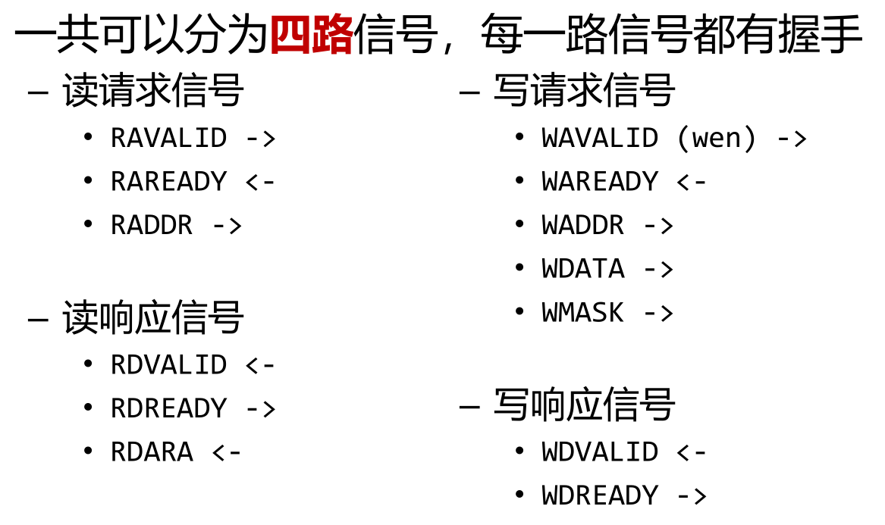
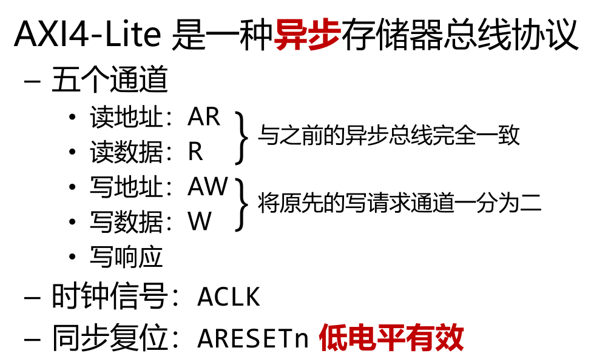

# 总线

一组统一的信号和协议。

master:主动发出请求

slave:被动响应请求 

同步读SRAM：读写延迟固定一周期 


读SRAM，最简单的思路只要两个信号

```
读哪里: RADDR ->
读多少: 约定一次读一个字
读多久: 一周期固定延迟
读了什么: RDATA<-
```

可读可写的同步总线

```
写地址: WADDR ->
写数据: WDATA ->
并非每个周期都要写，需要写使能: wen ->
允许写指定的部分字节，需要写掩码 ：WMASK -> (例如约定一次读写一个字32bit,只写低8位，WMASK=0xff)
```

更常见的是DRAM,使用异步总线。

握手信号

```
slave告诉master读好了 ： RDVALID <-
当RDVALID有效时，master才认为RDDATA有效
```

但是读没有读使能，slave会认为master每个周期都在发送读请求，而slave需要多个周期才能响应master的一个请求，产生堵塞。需要读使能RAVALID ->,

如果RAVALID在某段时间内经常为有效电平，未响应请求会越来越多，直到缓冲区耗尽，需要让slave告诉master无法再接受新的请求，需添加RDRAEADY<-,

只有RAREADY有效，master才会认为slave可以接受请求。类似添加WREADY<-

握手信号

```
valid ： 一方想发送
ready :  另一方能接收
valid && ready : 一次成功传输
```

如果master也不能一直都能接受读响应，需添加读响应就绪信号 RDEREADY -> 

写响应同上，

```
写响应有效 ：WDVALID <-
写响应就绪 : WDREADY ->
```

从而异步总线可以分为四路信号



注意数据响应都是slave发给master

AXI4-Lite 是一种异步总线，和上图不同的在于 将写地址和写数据分开，



 
