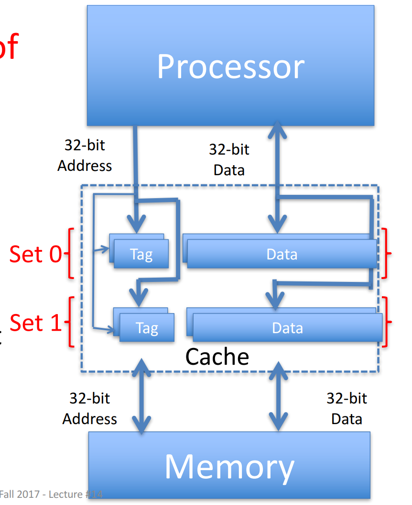

## overview

CPU RAM 总线的关系

ITCM指令存储， DTCM数据存储

Top中仅仅例化了cpu和srams,其中cpu是处理器核的所有逻辑部分，srams是处理器的所有sram部分

## Nutshell

https://oscpu.github.io/NutShell-doc/%E4%BB%8B%E7%BB%8D/introduction.html

前端： 分支预测 + 取值

后端：执行指令

访存单元LSU

前端完成取指与译码操作后会将指令放置在译码缓冲区(?ISU?)中. 后端从译码缓冲区中读出指令并顺序执行. 访存单元作为一个功能单元 (FU) 包含在后端流水线中. 控制逻辑分布在流水线的各个部分.

TODO:star: 访存单元LSU   ICACHE   DCACHE 压缩指令

### 运行层次

AM

NEMU

Nutshell

### 取指

Next-Line 分支预测器 (NLP)

指令对齐缓冲

### 发射级

什么意思？

数据前递？

### 执行级

ALU/BRU  MDU  CSR/MOU  LSU

### 写回级

指令重定向？

### 访存单元

一致性？

### 分支预测

https://oscpu.github.io/NutShell-doc/%E5%8A%9F%E8%83%BD%E9%83%A8%E4%BB%B6/bpu.html

## 香山

生成单核代码 top.v    ->   verilator生成仿真程序  -> AM生成workload

->nemu运行workload  ->  利用前面生成好的仿真程序，NEMU 动态链接库与 workload

## 蜂鸟

